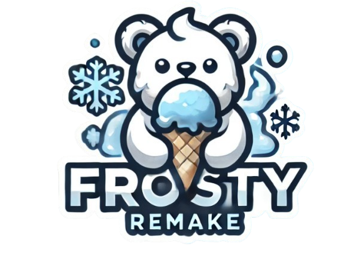

<p align="center">
  
</p>
<p align="center">
  
  
  
</p>
<p align="center">
  
  
  
</p>

<h3> Contributors </h3>
<p align="start">
  <a href="https://github.com/DeliciousBoy/frostybear-frontend/graphs/contributors">
    
  </a>
</p>

## Setup

To set up the Node.js project, follow these steps:

1. **Clone the repository:**
   ```sh
   git clone https://github.com/DeliciousBoy/frostybear-remake.git
   cd frostybear-remake
   ```

2. **Install dependencies:**
   ```sh
   npm install
   ```

3. **Run the project:**
   ```sh
   npm start
   ```

4. **Run tests:**
   ```sh
   npm test
   ```

